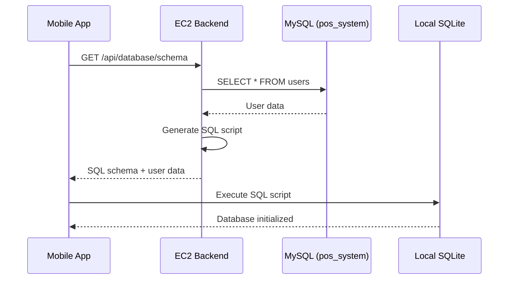
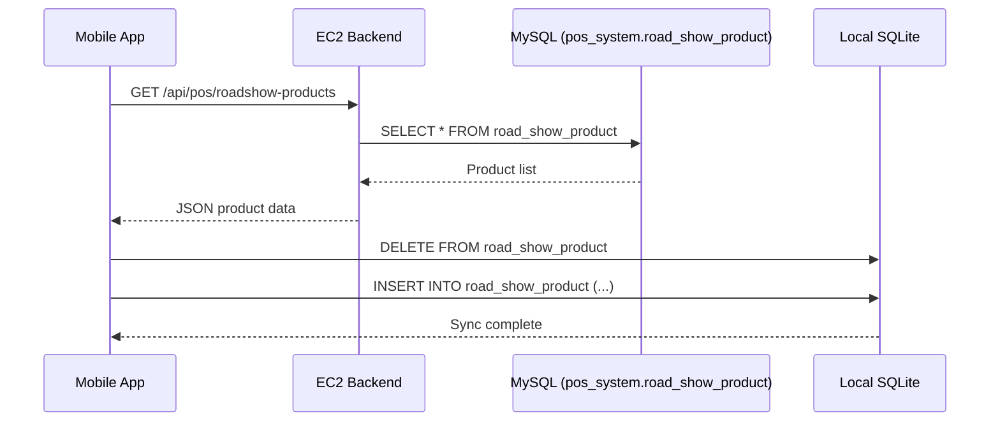
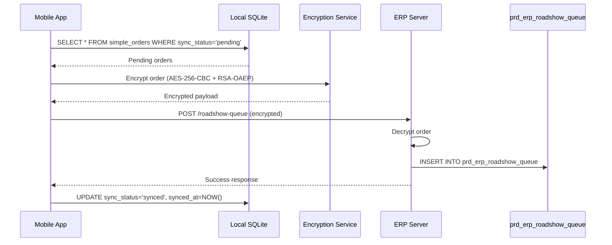
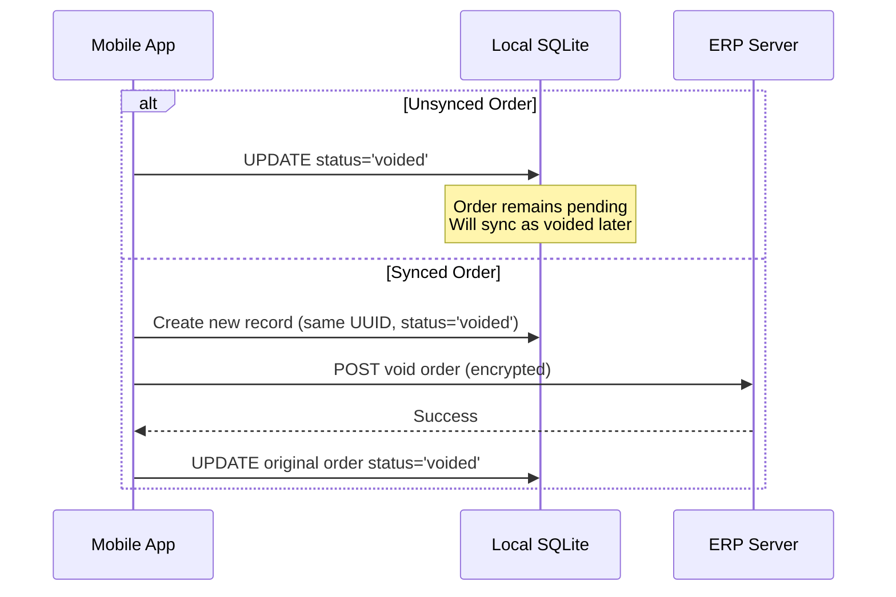

# RC POS System

> A comprehensive offline-first Point of Sale system with React Native mobile app and Spring Boot backend, designed for retail environments with unreliable internet connectivity.

## Overview

The RC POS System consists of two main components:

- **rc-pos** (Mobile App): React Native/Expo application running on Android/iOS devices
- **RC-POS-Backends** (Server): Spring Boot Java backend running on EC2, managing MySQL databases and providing REST APIs

The system enables cashiers to process transactions completely offline, with automatic synchronization when connectivity is restored. All data is stored locally in SQLite on the mobile device and synced to backend MySQL databases (`pos_system` and `erp`) when online.

## Key Features

### Core Functionality

- **Offline-First Architecture**: Full POS functionality without internet connection
- **Device Initialization**: SQLite database initialization from EC2 Java backend
- **Product Management**: Fetch and sync products from `pos_system.road_show_product` table
- **Order Processing**: Create, manage, and sync orders with encryption
- **Void Orders**: Handle voided orders (synced and unsynced) with UUID tracking
- **Barcode Scanning**: Scan product codes after fetching products from backend
- **Thermal Printing**: Print receipts on Sunmi thermal printers
- **Local Dashboard**: Real-time sales analytics from local SQLite database
- **Developer Mode**: Special tools and features for developers

### User Roles

- **Cashier**: Process sales, scan products, print receipts
- **Manager**: View dashboard, manage products, access order records
- **Admin**: Full system access, user management, configuration
- **Developer**: Access to developer tools, debug features, environment switching

## Architecture

### System Components

```
┌─────────────────────────────────────────────────────────────┐
│                    Mobile App (rc-pos)                      │
│  React Native + Expo + SQLite (Local Database)              │
└───────────────────────┬─────────────────────────────────────┘
                        │
                        │ HTTPS/REST API
                        │ (When Online)
                        │
┌───────────────────────▼─────────────────────────────────────┐
│              Backend Server (RC-POS-Backends)               │
│              Spring Boot on EC2                             │
│                                                             │
│  ┌──────────────┐  ┌──────────────┐  ┌──────────────┐       │
│  │  pos_system  │  │     erp      │  │   SQLite     │       │
│  │   (MySQL)    │  │   (MySQL)    │  │  (Local DB)  │       │
│  └──────────────┘  └──────────────┘  └──────────────┘       │
└─────────────────────────────────────────────────────────────┘
```

### --------------------------------------------------------- Data Flow ---------------------------------------------------------

1. **Device Initialization**: Backend provides SQL schema → Mobile initializes SQLite
2. **Product Sync**: Backend MySQL (`pos_system.road_show_product`) → Mobile SQLite (`road_show_product`)
3. **Order Creation**: Mobile SQLite (`simple_orders`) → Encrypted upload → ERP Roadshow Queue
4. **Order Void**: Mobile creates void record → Uploads to server with same UUID, status="voided"

## Feature Details

### 1. Device Initialization (SQLite from EC2 Java Backend)

**Flow:**

1. Mobile app requests database schema from backend: `GET /api/database/schema`
2. Backend (`DatabaseInitController`) generates SQL script with:
   - Table definitions (`users`, `simple_orders`, `road_show_product`, `example`)
   - User data from `pos_system.users` table
   - Indexes for performance
3. Mobile app executes SQL script to initialize local SQLite database
4. Database is ready for offline operation

**Backend Endpoints:**

- `GET /api/database/schema` - Get SQL schema for client initialization
- `POST /api/database/init` - Initialize database (server-side)
- `GET /api/database/migrations` - Get migration SQL statements
- `POST /api/database/migrate` - Apply migrations

**Tables Created:**

- `users` - User authentication (synced from `pos_system.users`)
- `simple_orders` - POS transaction orders
- `road_show_product` - Product catalog (synced from `pos_system.road_show_product`)
- `example` - Demo/todo table

### 2. Product List Fetch & Sync

**Flow:**

1. Mobile app fetches products from backend: `GET /api/pos/roadshow-products`
2. Backend queries `pos_system.road_show_product` table
3. Mobile app clears local `road_show_product` table
4. Mobile app inserts all products into local SQLite
5. Products are now available offline for scanning and sales

**Backend Endpoints:**

- `GET /api/pos/roadshow-products` - List all products ----- //Currently only using this to fetch all product
- `GET /api/pos/roadshow-products/{id}` - Get by ID
- `GET /api/pos/roadshow-products/sku/{sku}` - Get by SKU
- `GET /api/pos/roadshow-products/barcode/{barcode}` - Get by barcode

**Mobile Features:**

- Manual sync button in Product Master screen
- Pull-to-refresh to sync
- Product count display
- Search and filter products

### 3. Scan Product Code (After Fetch Product)

**Flow:**

1. User scans barcode or enters SKU manually
2. Mobile app searches local SQLite `road_show_product` table:
   - Search by SKU: `SELECT * FROM road_show_product WHERE sku = ?`
   - Search by barcode: `SELECT * FROM road_show_product WHERE barcode = ?`
3. If found, product added to order cart
4. If not found, error message displayed

**Features:**

- Auto-scan mode (barcode scanner input)
- Manual input mode (keyboard entry)
- Product caching for faster lookups
- Duplicate product detection (increments quantity)
- Real-time feedback (success/error messages)

**Scanner Integration:**

- Works with hardware barcode scanners (keyboard wedge mode)
- Supports manual SKU/barcode entry
- Auto-focus input field in scan mode
- Debounced search to handle rapid scans

### 4. Thermal Printer

**Integration:**

- **Device Support**: Sunmi thermal printers (built-in)
- **Library**: `@mitsuharu/react-native-sunmi-printer-library`
- **Paper Size**: 58mm thermal paper

**Receipt Format:**

- Logo (base64 image, centered)
- Website URL (centered)
- Date and time (centered)
- Order number (centered)
- Product table (Model, QTY, Price)
- Financial summary (Total, Discount, Net, Amount Received, Change)
- Payment method display
- Thank you message (centered)
- Store addresses (left-aligned)

**Print Features:**

- Automatic paper cutting (if supported)
- Alignment control (center/left)
- Chinese character support
- Currency formatting
- Error handling and user feedback

**Print Flow:**

1. User taps "Print Summary" button
2. App detects Sunmi device
3. Prepares printer (alignment, font size)
4. Prints logo (if available)
5. Prints receipt text with proper formatting
6. Cuts paper
7. Shows success/error alert

### 5. Order Upload/Sync to Server (prd_erp_roadshow_queue)

**Flow:**

1. Order created in mobile SQLite with `sync_status='pending'`
2. When online, mobile app encrypts order data:
   - AES-256-CBC encryption for order payload
   - RSA-OAEP encryption for AES key
3. Encrypted order posted to ERP Roadshow Queue endpoint
4. Backend receives encrypted data, decrypts, and inserts into `prd_erp_roadshow_queue` table
5. Mobile updates local order `sync_status='synced'` and sets `synced_at` timestamp

**Encryption Details:**

- **Algorithm**: AES-256-CBC for data, RSA-OAEP for key exchange
- **Key Generation**: Random AES key (32 bytes) + IV (16 bytes) per order
- **Payload Format**: `{key, iv, data, delay}` where:
  - `key`: RSA-encrypted AES key (base64)
  - `iv`: Initialization vector (base64)
  - `data`: AES-encrypted order JSON (base64)
  - `delay`: Request delay (0)

**Order Data Structure:**

```json
{
  "order_id": 123,
  "uuid": "device-id-order-123-timestamp",
  "nonce": "roadshow-nonce-123",
  "request_time": 1234567890,
  "staff_id": "staff001",
  "timestamp": "2024-01-01T12:00:00Z",
  "products": [...],
  "products_total": 100.00,
  "misc": 0,
  "total_amount": 100.00,
  "discount": 0,
  "net_amount": 100.00,
  "net_received": 100.00,
  "change_amount": 0,
  "payment_reference": "",
  "status": "completed",
  "is_override": 0,
  "payment_method": "cash",
  "uploadDevice": "device-id"
}
```

**Mobile Features:**

- Upload single order or batch upload all pending orders
- Progress tracking for batch uploads
- Cancel upload functionality
- Automatic retry on failure
- Tabs: Pending, Synced, Voided

### 6. Void Order (Synced or Not Yet Synced)

**Void Logic:**

- **Unsynced Order**:

  1. Update local order `status='voided'`
  2. Order remains in local SQLite with voided status
  3. When synced later, voided order won't be uploaded to server

- **Synced Order**:
  1. Create new order record with same UUID but `status='voided'`
  2. Copy all order data from original order
  3. Upload void record to server immediately
  4. Update original order `status='voided'` in local database

**UUID Handling:**

- Original order: `uuid = "device-id-order-123-timestamp"`
- Void order: `uuid = "device-id-order-123-timestamp"` (same UUID)
- Server identifies void orders by UUID + status combination

**Mobile Features:**

- Void button in order detail view
- Confirmation dialog before voiding
- Automatic sync for already-synced orders
- Voided orders shown in separate tab

### 7. Local Dashboard

**Features:**

- **Statistics Cards**:

  - Total Sales (sum of all non-voided orders)
  - Total Orders (count of non-voided orders)
  - Average Order Value
  - Today's Sales

- **Sales Chart**:

  - Bar chart showing sales by day/week/month
  - Visual representation of sales trends

- **Recent Orders**:
  - List of recent transactions
  - Order details (ID, date, amount, status)
  - Quick access to order details

**Data Source:**

- All data from local SQLite `simple_orders` table
- Filters out voided orders for statistics
- Real-time updates when new orders are created
- Pull-to-refresh to reload data

**Performance:**

- Efficient SQL queries with indexes
- Pagination for large datasets
- Cached queries with React Query
- Optimistic UI updates

### 8. Developer Mode

**Access:**

- Only visible to users with `role='developer'`
- Floating dev button (draggable) in bottom-right corner
- Tools icon with red error container background

**Features:**

- **Upload Order Dev Tool**:

  - View all orders in database
  - Manually trigger order uploads
  - Test encryption and upload flow
  - Debug sync issues

- **Environment Switching**:

  - Toggle between production and development servers
  - Change upload URL for testing
  - Database environment selection

- **Device Information**:

  - View device ID
  - Check device registration status
  - Debug authentication issues

- **Database Tools**:
  - View SQLite database contents
  - Execute custom queries
  - Export database for debugging

**Developer Button:**

- Draggable floating action button
- Modal overlay for dev tools
- Only visible to developers
- Position persists during session

## --------------------------------------------------------- Database Schema ---------------------------------------------------------

### Mobile SQLite Tables

#### `users`

- `id` (INTEGER PRIMARY KEY)
- `backend_user_id` (INTEGER) - Reference to `pos_system.users.id`
- `email` (TEXT UNIQUE)
- `name` (TEXT)
- `password_hash` (TEXT)
- `role` (TEXT) - 'admin', 'manager', 'cashier', 'developer'
- `is_active` (INTEGER)
- `created_at` (DATETIME)
- `updated_at` (DATETIME)

#### `simple_orders`

- `id` (INTEGER PRIMARY KEY)
- `staff_id` (TEXT)
- `timestamp` (INTEGER) - Unix timestamp
- `products` (TEXT) - JSON string
- `products_total` (REAL)
- `misc` (REAL)
- `total_amount` (REAL)
- `discount` (REAL)
- `net_amount` (REAL)
- `net_received` (REAL)
- `change_amount` (REAL)
- `payment_reference` (TEXT)
- `status` (TEXT) - 'completed', 'voided', 'refunded'
- `sync_status` (TEXT) - 'pending', 'synced', 'failed'
- `is_override` (INTEGER) - 0 or 1
- `payment_method` (TEXT) - 'cash', 'octopus', 'credit_card'
- `created_at` (DATETIME)
- `updated_at` (DATETIME)
- `synced_at` (DATETIME)

#### `road_show_product`

- `product_id` (INTEGER PRIMARY KEY)
- `brand_name` (TEXT)
- `sku` (TEXT NOT NULL)
- `model_number` (TEXT)
- `product_name` (TEXT)
- `barcode` (TEXT)
- `price` (REAL)
- `qty` (INTEGER)
- `created_at` (DATETIME)
- `updated_at` (DATETIME)
- `created_by` (INTEGER)
- `updated_by` (INTEGER)

### Backend MySQL Tables

#### `pos_system.road_show_product`

- Source table for product catalog
- Synced to mobile SQLite `road_show_product` table

#### `pos_system.users`

- User accounts synced to mobile SQLite `users` table

#### `erp.prd_erp_roadshow_queue`

- Destination table for encrypted order uploads
- Receives decrypted order data from mobile app

#### ERP MySQL Database (`erp`)

- **Java APIs Available**: The backend has full REST API support for ERP MySQL database
- **Product APIs**: `/api/products` - Product management (CRUD operations)
- **Product Description APIs**: `/api/product-descriptions` - Multi-language product descriptions
- **Product Barcode APIs**: `/api/product-barcodes` - Product barcode management
- **Adjustment Detail APIs**: `/api/adjustment-details` - Inventory adjustment details
- **Note**: Currently, product details are synced to an external ERP server endpoint, but it uses the same `erp` database and tables. The Java backend APIs are ready for direct ERP database access when needed.

## Setup & Installation

### Backend (RC-POS-Backends)

**Prerequisites:**

- Java 17+
- Maven 3.6.3+
- MySQL 8.0+

**Local Development:**

```bash
cd RC-POS-Backends
mvn clean package -DskipTests
java -jar target/pos-backend-1.0.0.jar
```

**EC2 Deployment:**
See [`RC-POS-Backends/README.md`](../RC-POS-Backends/README.md) for detailed deployment instructions.

**Configuration:**
Edit `src/main/resources/application.properties`:

```properties
# POS Database
spring.datasource.pos.jdbc-url=jdbc:mysql://HOST:3306/pos_system
spring.datasource.pos.username=USERNAME
spring.datasource.pos.password=PASSWORD

# ERP Database
spring.datasource.erp.jdbc-url=jdbc:mysql://HOST:3306/erp
spring.datasource.erp.username=USERNAME
spring.datasource.erp.password=PASSWORD
```

### Mobile App (rc-pos)

**Prerequisites:**

- Node.js 18+
- Expo CLI
- Android Studio (for Android)

**Installation:**

```bash
cd rc-pos
npm install
npx expo start
```

**Configuration:**
Edit `lib/config/environment.ts`:

```typescript
export const config = {
  API_BASE_URL: "http://YOUR_SERVER:8080/api",
  ROADSHOW_UPLOAD_URL: "https://YOUR_ERP_SERVER/roadshow-queue",
};
```

**Build APK:**
See [`RELEASE-APK-GUIDE.md`](./RELEASE-APK-GUIDE.md) for detailed build instructions.

## -------------------------------------------------------- Data Flow Diagrams ------------------------------------------------------

### Device Initialization Flow



### Product Sync Flow



### Order Upload Flow



### Void Order Flow



## API Endpoints

### Authentication

- `POST /api/auth/login` - User login
- `POST /api/auth/refresh` - Refresh access token
- `POST /api/auth/logout` - Logout

### Database

- `GET /api/database/schema` - Get SQLite schema
- `POST /api/database/init` - Initialize database
- `GET /api/database/migrations` - Get migrations
- `POST /api/database/migrate` - Apply migrations

### Products (POS Database)

- `GET /api/pos/roadshow-products` - List all products
- `GET /api/pos/roadshow-products/{id}` - Get by ID
- `GET /api/pos/roadshow-products/sku/{sku}` - Get by SKU
- `GET /api/pos/roadshow-products/barcode/{barcode}` - Get by barcode
- `POST /api/pos/roadshow-products` - Create product
- `PUT /api/pos/roadshow-products/{id}` - Update product
- `DELETE /api/pos/roadshow-products/{id}` - Delete product

### ERP Products (ERP MySQL Database)

**Note**: These APIs are available in the Java backend but currently product details are synced via external ERP server endpoint (same database/table).

- `GET /api/products` - List all ERP products
- `GET /api/products/{id}` - Get product by ID
- `POST /api/products` - Create product
- `PUT /api/products/{id}` - Update product
- `DELETE /api/products/{id}` - Delete product
- `GET /api/products/status/{status}` - Get products by status
- `GET /api/products/brand/{brandId}` - Get products by brand
- `GET /api/products/sku/{sku}` - Get products by SKU
- `GET /api/products/barcode/{barcode}` - Get products by barcode

### ERP Product Descriptions

- `GET /api/product-descriptions` - List all product descriptions
- `GET /api/product-descriptions/{productId}/{siteId}/{languageId}` - Get by composite key
- `POST /api/product-descriptions` - Create product description
- `PUT /api/product-descriptions/{productId}/{siteId}/{languageId}` - Update product description
- `DELETE /api/product-descriptions/{productId}/{siteId}/{languageId}` - Delete product description
- `GET /api/product-descriptions/product/{productId}` - Get descriptions by product ID
- `GET /api/product-descriptions/site/{siteId}` - Get descriptions by site ID
- `GET /api/product-descriptions/language/{languageId}` - Get descriptions by language ID

### ERP Product Barcodes

- `GET /api/product-barcodes` - List all product barcodes
- `GET /api/product-barcodes/{productId}/{barcode}` - Get by composite key
- `POST /api/product-barcodes` - Create product barcode
- `PUT /api/product-barcodes/{productId}/{barcode}` - Update product barcode
- `DELETE /api/product-barcodes/{productId}/{barcode}` - Delete product barcode

### ERP Adjustment Details

- `GET /api/adjustment-details` - List all adjustment details
- `GET /api/adjustment-details/{id}` - Get adjustment detail by ID
- `POST /api/adjustment-details` - Create adjustment detail
- `PUT /api/adjustment-details/{id}` - Update adjustment detail
- `DELETE /api/adjustment-details/{id}` - Delete adjustment detail
- `GET /api/adjustment-details/product/{productId}` - Get adjustments by product ID

### Devices

- `GET /api/pos/devices` - List devices
- `POST /api/pos/devices` - Register device
- `GET /api/pos/devices/{id}` - Get device info

**Full API Documentation:** http://YOUR_SERVER:8080/swagger-ui.html

## Troubleshooting

### Common Issues

**Device Initialization Fails:**

- Check backend is running and accessible
- Verify MySQL connection in backend
- Check network connectivity
- Review backend logs for errors

**Product Sync Fails:**

- Verify backend has products in `pos_system.road_show_product`
- Check API endpoint is accessible
- Review mobile app logs for network errors
- Ensure SQLite database is initialized

**Order Upload Fails:**

- Check encryption keys are correct
- Verify ERP server endpoint is accessible
- Review encryption logs for errors
- Check order data format matches server expectations

**Barcode Scanner Not Working:**

- Verify products are synced to local database
- Check scanner is in keyboard wedge mode
- Test manual SKU entry
- Review product table for correct SKU/barcode format

**Printer Not Working:**

- Verify device is Sunmi brand
- Check printer library is installed
- Review printer connection
- Test with sample print

**Dashboard Not Showing Data:**

- Verify orders exist in `simple_orders` table
- Check SQLite database is accessible
- Review query logs for errors
- Refresh dashboard data

For more detailed troubleshooting, see [`TROUBLESHOOTING.md`](./TROUBLESHOOTING.md).

## Development

### --------------------------------------------------------- Code Structure ---------------------------------------------------------

**Mobile App (rc-pos):**

```
app/                    # Expo Router screens
components/             # React components
lib/
  api/                  # API client
  database/             # SQLite repositories
  hooks/                # React hooks
  stores/               # Zustand stores
endpoints/              # API endpoints and repositories
```

**Backend (RC-POS-Backends):**

```
src/main/java/com/pos/
  pos/                   # POS database (pos_system)
  erp/                   # ERP database (MySQL APIs ready)
    controller/          # ERP REST controllers
    service/             # ERP business logic
    model/               # ERP data models
    persistance/         # ERP JPA entities and DAOs
  sqlite/                # SQLite controller
  config/                 # Configuration
  shared/                 # Shared utilities
```

**Note on ERP Integration:**

- The Java backend has full REST API support for the ERP MySQL database (`erp`)
- ERP APIs are available for Products, Product Descriptions, Product Barcodes, and Adjustment Details (Example APIs for future
  development)
- Currently, product details are synced to an external ERP server endpoint, but it uses the same `erp` database and tables
- The Java backend APIs can be used for direct ERP database access when needed

### Testing

**Backend:**

```bash
cd RC-POS-Backends
mvn test
```

**Mobile App:**

```bash
cd rc-pos
npm test
```

## Security

- **Authentication**: JWT tokens with refresh mechanism
- **Encryption**: AES-256-CBC for order data, RSA-OAEP for key exchange
- **Device Authorization**: Device ID validation on backend
- **Secure Storage**: Expo SecureStore for sensitive data
- **HTTPS**: All API communication over HTTPS in production

## License

Proprietary - ThermalPolaroid

## Support

- **Documentation**: See project README files and guides
- **Backend Issues**: Check [`RC-POS-Backends/README.md`](../RC-POS-Backends/README.md)
- **Mobile Issues**: Check [`TROUBLESHOOTING.md`](./TROUBLESHOOTING.md)
- **Product Sync**: See [`ROADSHOW-PRODUCT-SYNC-GUIDE.md`](./ROADSHOW-PRODUCT-SYNC-GUIDE.md)

---

**Built with ❤️ using React Native, Expo, Spring Boot, and SQLite**
